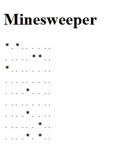
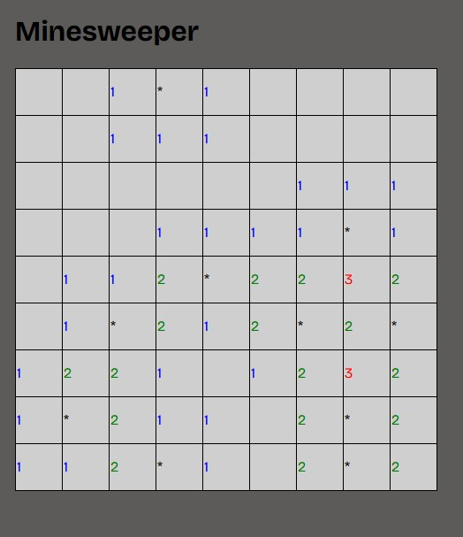
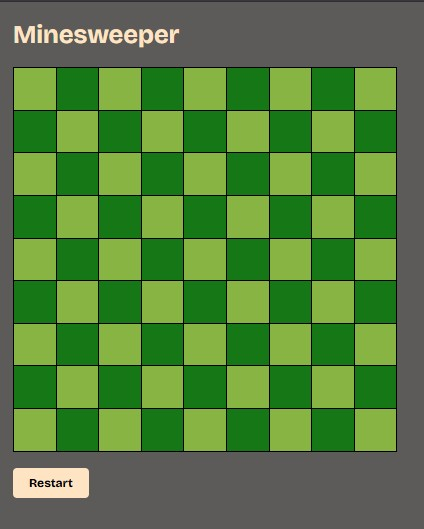

# Minesweeper

A basic game of Minesweeper written in vanilla JavaScript.

## Documentation

While working on the project, I made some screenshots to document the process of developing.
See the progress here:

First POC:
 

First css and more logic:
 

Final form:
 

## Lessons Learned
#### Why did you do this project?
I noticed that I coded more with ai than I did myself. So I began to code this project. AI hasn't written a single line of code. I used Claude Code as a teacher, who gave me insigths in theory and concepts.

#### What did you learn while building this project? 
I learned a lot about vanilla js and got more comfortable with it. For example I learned how to build a basic game. I haven't had to plan and break down a game like this before, so this was really useful. For example thinking about that the cell is a object, and which parameters it got.

Also, the ussage of functions, loops and event listeners was always something I was a bit confused about. Now I now what the hell I am doing. 

#### What challenges did you face and how did you overcome them?
At the start I was already overwhelmed by the 2d-Array. It took me some time to figure out how to loop over everything inside example[][].

## Authors

- [@mike-s-zaugg](https://www.github.com/mike-s-zaugg)

